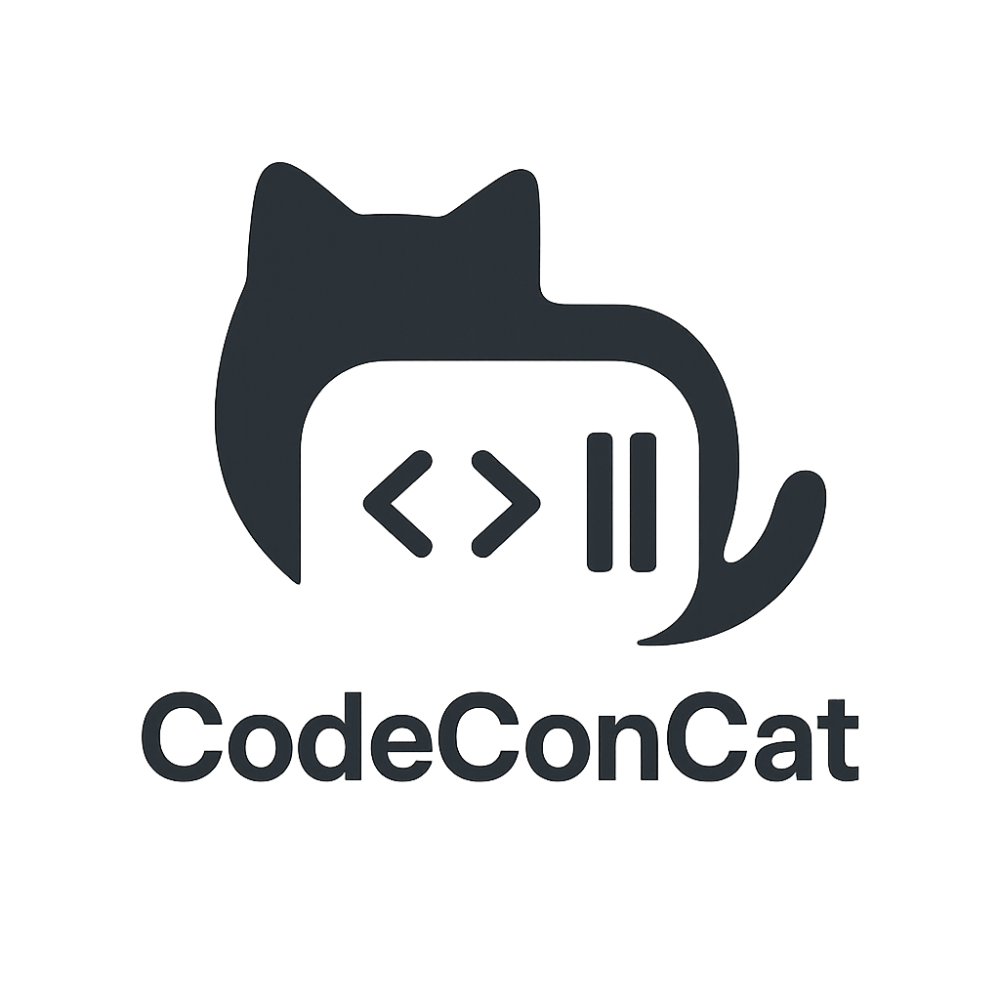

# CodeConCat

<p align="center">
  
</p>

<p align="center">
  <strong>Transform codebases into AI-ready formats with parsing, compression, and security analysis</strong>
</p>

[](https://github.com/biostochastics/codeconcat) [](https://www.python.org/downloads/) [](https://opensource.org/licenses/MIT) [](https://github.com/astral-sh/ruff) [](http://mypy-lang.org/) [](https://github.com/pre-commit/pre-commit) [](https://python-poetry.org/) [](https://typer.tiangolo.com/)

## Overview

CodeConCat is a Python tool that transforms codebases into formats optimized for AI consumption and analysis. It automatically processes your code to extract functions, classes, imports, and documentation across 12+ programming languages. The tool provides structured output with context generation, making it ideal for sharing code with AI assistants and automated analysis.

### Security Features
- **API access controls**: Configurable path access and authentication
- **Thread-safe operations**: Concurrent request handling with isolated configurations
- **Command injection prevention**: Sanitized external command execution with input validation
- **Memory management**: File size limits and resource controls
- **Path validation**: Traversal protection and symlink handling
- **Secure Git operations**: All repository URLs and tokens are sanitized before use

## Key Features

- **Multi-Language Parsing**: Parsing for 12+ languages using tree-sitter and regex engines
- **AI Summarization** *(Optional)*: Code summarization using OpenAI, Anthropic, Google, OpenRouter, or local models
- **Differential Outputs**: Generate diffs between Git refs (branches, tags, commits) with AI-powered change summaries
- **Compression**: Code compression with pattern recognition and two simplified modes
- **Security Scanning**: Integrated Semgrep support with configurable severity thresholds
- **Multiple Output Formats**: Markdown, JSON, XML, and text outputs
- **Remote Repository Support**: Analyze GitHub repositories directly using GitPython
- **Parallel Processing**: Configurable worker threads for performance
- **File Reconstruction**: Restore original source files from output
- **REST API**: FastAPI server for programmatic access
- **Modern CLI**: Typer-based interface with shell completion, validation, and rich help
- **Caching**: TTL-based cache management

## ⚠️ Security Warning & Disclaimer

### Prompt Injection Risks

This tool processes and concatenates code for AI model consumption. As with any tool that prepares data for Large Language Models (LLMs), there are inherent security risks:

- **Prompt Injection Vulnerability**: Malicious code comments, docstrings, or specially crafted file contents could potentially manipulate AI model behavior when the output is used as input to an LLM
- **Code Execution Context**: The concatenated output may contain code that, if executed without review, could pose security risks
- **Sensitive Data Exposure**: The tool may inadvertently include sensitive information (API keys, credentials, internal documentation) in its output despite built-in security scanning

### Recommended Security Practices

1. **Review Output**: Always review the generated output before sharing with AI models or third parties
2. **Sanitize Sensitive Data**: Use the security scanning features (`--security`, `--semgrep`) to identify potential sensitive information
3. **Validate AI Responses**: Treat all AI-generated code suggestions based on this tool's output as untrusted input requiring validation
4. **Restrict Access**: Use API access controls and authentication when deploying the REST API
5. **Environment Isolation**: Process untrusted codebases in isolated environments

### Liability Disclaimer

**NO WARRANTY**: This software is provided "as is", without warranty of any kind, express or implied, including but not limited to the warranties of merchantability, fitness for a particular purpose, and noninfringement.

**NO LIABILITY**: In no event shall the authors, contributors, or copyright holders be liable for any claim, damages, or other liability, whether in an action of contract, tort, or otherwise, arising from, out of, or in connection with the software or the use or other dealings in the software.

**USE AT YOUR OWN RISK**: Users assume all responsibility for:
- Security implications of processing and sharing code
- Validation of AI-generated responses based on tool output
- Protection of sensitive information in processed codebases
- Consequences of executing any code suggested by AI models
- Compliance with applicable security policies and regulations

By using this tool, you acknowledge and accept these risks and agree to implement appropriate security measures for your use case.

## Language Support

### Supported Languages

CodeConCat provides comprehensive parsing for the following languages:

| Language | Tree-sitter Parser | Enhanced Regex Parser | Key Features |
|----------|-------------------|----------------------|--------------|
| **Python** | Yes | Yes | Type hints, async/await, decorators, dataclasses, docstrings |
| **JavaScript/TypeScript** | Yes | Yes | JSX/TSX, ES6+, arrow functions, modules, decorators |
| **Java** | Yes | Yes | Generics, annotations, lambdas, records, streams |
| **C/C++** | Yes | Yes | Templates, namespaces, modern C++ features, preprocessor |
| **C#** | Yes | Yes | Generics, attributes, async/await, LINQ, properties |
| **Go** | Yes | Yes | Interfaces, embedded types, generics, goroutines |
| **Rust** | Yes | Yes | Traits, lifetimes, macros, async, ownership |
| **PHP** | Yes | Yes | Traits, namespaces, attributes, typed properties |
| **Julia** | Yes | Yes | Multiple dispatch, macros, type annotations |
| **R** | Yes | Yes | S3/S4 classes, tidyverse, data.table |
| **Swift** | Yes | Yes | Classes, structs, protocols, actors, SwiftUI, async/await |
| **Bash/Shell** | Yes | No | Functions, variables, aliases, source imports |
| **TOML** | No | Yes | Configuration parsing, nested tables |

### Parser Features

- **Automatic Fallback**: Seamlessly switches from tree-sitter to regex parsing on errors
- **Unicode Support**: Handles BOM removal, encoding detection, and NFC normalization
- **Error Recovery**: Continues parsing even with syntax errors
- **Docstring Extraction**: Captures documentation in language-specific formats
- **Structure Preservation**: Maintains code hierarchy and relationships

## Parser Architecture

CodeConCat uses an intelligent multi-tier parser system with **result merging** for maximum reliability and feature coverage:

### Parser Types

1. **Tree-sitter Parsers** (Primary)
   - Full syntax tree parsing for accurate code structure recognition
   - Support for language-specific features and precise source locations
   - Handles nested declarations and complex constructs
   - Query result caching for improved performance
   - Located in `codeconcat/parser/language_parsers/tree_sitter_{language}_parser.py`
   - **New in v0.8.2**: Swift support via tree-sitter-swift grammar

2. **Enhanced Regex Parsers** (Fallback)
   - Pattern-based parsing with state tracking
   - Support for edge cases and malformed code
   - Improved docstring extraction and handling
   - **Shared infrastructure** for reduced duplication
   - Located in `codeconcat/parser/language_parsers/enhanced_{language}_parser.py`

3. **Standard Regex Parsers**
   - Reliable fallback for languages without tree-sitter support
   - Swift parser includes comprehensive pattern matching for all language features
   - Located in `codeconcat/parser/language_parsers/{language}_parser.py`

### Intelligent Result Merging

**New in v0.8.4**: CodeConCat now intelligently merges results from multiple parsers instead of picking a single winner:

- **Maximum Coverage**: Combines declarations from all parsers (tree-sitter + enhanced + standard)
- **Confidence Scoring**: Weights results by parser quality and completeness
- **Duplicate Detection**: Eliminates redundant declarations using signature-based matching
- **Configurable Strategies**:
  - `confidence` (default): Weight by confidence scores
  - `union`: Union all detected features
  - `fast_fail`: First high-confidence wins (legacy behavior)
  - `best_of_breed`: Pick best parser per feature type

```yaml
# In .codeconcat.yml
enable_result_merging: true  # Default: true
merge_strategy: confidence   # Options: confidence, union, fast_fail, best_of_breed
```

### Modern Syntax Support

**New in v0.8.4**: Built-in patterns for modern language features:

- **TypeScript 5.0+**: `satisfies` operator, const assertions, type predicates
- **Python 3.11+**: Pattern matching, walrus operator, union types, PEP 695 type parameters
- **Go 1.18+**: Generics, type constraints
- **Rust**: Async functions, const generics, impl Trait
- **PHP 8.0+**: Named arguments, match expressions, enums, readonly properties

### Parser Selection

Use the `--parser-engine` flag to choose between:
- `tree_sitter` (default): High accuracy with automatic fallback and result merging
- `regex`: Force regex-based parsing for compatibility

## System Architecture

```
┌─────────────────────────────────────────────────────────────┐
│                        User Interface                        │
│  (CLI, REST API, Python API, Configuration Files)          │
└─────────────────────────────────────────────────────────────┘
                              │
┌─────────────────────────────────────────────────────────────┐
│                      Core Pipeline                           │
│  ┌──────────┐  ┌──────────┐  ┌──────────┐  ┌──────────┐  │
│  │Collector │→ │  Parser  │→ │Processor │→ │  Writer  │  │
│  └──────────┘  └──────────┘  └──────────┘  └──────────┘  │
└─────────────────────────────────────────────────────────────┘
                              │
┌─────────────────────────────────────────────────────────────┐
│                    Supporting Services                       │
│  ┌──────────┐  ┌──────────┐  ┌──────────┐  ┌──────────┐  │
│  │Validation│  │ Security │  │Compression│  │ Language │  │
│  │          │  │ Scanner  │  │          │  │Detection │  │
│  └──────────┘  └──────────┘  └──────────┘  └──────────┘  │
└─────────────────────────────────────────────────────────────┘
```

## Output Formats

CodeConCat provides four output formats tailored for different use cases:

### XML Format
- Semantic tags for structure understanding
- Hierarchical navigation with file categorization
- Metadata elements for context
- Optional AI processing instructions (`--xml-pi/--no-xml-pi`)
- CDATA sections for content preservation

### Markdown Format
- Table of contents with anchor links
- Summary statistics and project overview
- Collapsible sections for large content
- Syntax highlighting for code blocks
- Cross-references between related files
- Security issue badges with severity indicators

### JSON Format
- Nested structure for traversal
- Indexes by language, type, and directory
- Relationship mapping between files
- Metadata for filtering and searching
- Statistics overview
- Compression segment support

### Text Format
- Box drawing characters for visual hierarchy
- 80-character width for terminal compatibility
- Progress indicators for file processing
- Visual file type indicators (📝 source, 🧪 test, 📄 doc)
- Line wrapping for long content
- Compact metadata display

## Codebase Analysis Features (Optional)

### AI-Powered Code Review Prompts
CodeConCat includes an optional prompt system for preparing codebases for LLM-based analysis. This feature is completely optional and does not affect normal operation:

```bash
# Normal operation (no prompt)
codeconcat run --format markdown -o output.md

# Use the built-in default analysis prompt
codeconcat run --prompt-file default

# Use a custom analysis prompt
codeconcat run --prompt-file ./my-review-prompt.md

# Add context variables to customize the prompt
codeconcat run --prompt-file ./my-review-prompt.md \
               --prompt-var "FOCUS_AREAS=security,performance" \
               --prompt-var "TEAM_SIZE=5"
```

When using a prompt file, the system provides structured analysis guidance across:
- Code quality and maintainability
- Architecture and design patterns
- Security assessment
- Performance optimization
- Testing coverage
- Documentation quality

## Installation

### Prerequisites

- Python 3.10 or higher (tested up to Python 3.13)
- Git (for repository cloning features)
- Poetry 1.8+ (recommended) or pip

### Using Poetry (Recommended)

```bash
# Install Poetry if you haven't already
curl -sSL https://install.python-poetry.org | python3 -

# Clone the repository
git clone https://github.com/biostochastics/codeconcat.git
cd codeconcat

# Install dependencies
poetry install

# Install with optional dependencies
poetry install --with dev,test,docs

# Run CodeConCat
poetry run codeconcat --help
```

### Using pip

```bash
# Install from PyPI (when published)
pip install codeconcat

# Install from source
git clone https://github.com/biostochastics/codeconcat.git
cd codeconcat
pip install -e .

# Install with extras
pip install -e ".[dev,test]"
```

## Quick Start

### Performance Note

CodeConCat can process large codebases efficiently. For example, processing its own codebase (100+ Python files) takes under 5 seconds with compression enabled, achieving 35-40% token reduction.

### Basic Usage

```bash
# Process current directory
codeconcat run

# Process specific directory
codeconcat run /path/to/project

# Process GitHub repository directly (NEW in v0.8.3)
codeconcat run https://github.com/owner/repo
codeconcat run owner/repo  # GitHub shorthand
codeconcat run git@github.com:owner/repo.git  # SSH URL

# Generate JSON output with compression
codeconcat run --format json --compress -o output.json

# Generate XML without AI processing instructions
codeconcat run --format xml --no-xml-pi -o output.xml

# Use lean preset for minimal output
codeconcat run --preset lean

# Process remote GitHub repository
codeconcat run --source-url owner/repo --github-token $GITHUB_TOKEN

# Filter by language and paths
codeconcat run -il python javascript -ep "*/tests/*" "*/node_modules/*"

# Advanced filtering with multiple patterns
codeconcat run \
    --include-path "src/**/*.py" "lib/**/*.py" \
    --exclude-path "**/test_*.py" "**/__pycache__/*" \
    --include-language python rust

# Production build with security scanning
codeconcat run \
    --format json \
    --compress --compression-level high \
    --security --security-threshold HIGH \
    --semgrep \
    --output production-audit.json

# Quick documentation extraction
codeconcat run \
    --docs --merge-docs \
    --remove-docstrings --remove-comments \
    --preset lean \
    --output docs-only.md

# Differential outputs - compare two Git refs (NEW in v0.8.4)
codeconcat run \
    --diff-from main \
    --diff-to feature-branch \
    --format markdown \
    --output changes.md

# Generate diff between commits with AI summaries
codeconcat run \
    --diff-from HEAD~5 \
    --diff-to HEAD \
    --ai-summary \
    --ai-provider anthropic \
    --output recent-changes.md

# Generate with reporting options
codeconcat run \
    --test-security-report \
    --unsupported-report \
    --output full-report.json
```

### Initialize Configuration

```bash
# Interactive configuration setup
codeconcat init

# Create config with specific preset
codeconcat init --preset medium --output custom-config.yml

# Non-interactive setup with defaults
codeconcat init --no-interactive

# Validate existing configuration
codeconcat validate .codeconcat.yml

# Force overwrite existing config
codeconcat init --force
```

### Reconstruct Files

```bash
# Reconstruct from output file
codeconcat reconstruct output.md

# Preview without creating files
codeconcat reconstruct output.json --dry-run

# Reconstruct to specific directory
codeconcat reconstruct output.xml -o ./restored

# Force overwrite existing files
codeconcat reconstruct output.md --force

# Verbose reconstruction with progress
codeconcat reconstruct output.json -v
```

### Start API Server

```bash
# Start on default port (8000)
codeconcat api start

# Development mode with auto-reload
codeconcat api start --reload

# Production with multiple workers
codeconcat api start --workers 4 --host 0.0.0.0 --port 8080

# Custom log level
codeconcat api start --log-level warning

# Show API information and endpoints
codeconcat api info
```

### Diagnostics

```bash
# Verify all Tree-sitter dependencies
codeconcat diagnose verify

# Test language parser
codeconcat diagnose parser python

# Test parser with specific file
codeconcat diagnose parser javascript -f test.js

# Show system information
codeconcat diagnose system

# List all supported languages
codeconcat diagnose languages
```

## Differential Outputs (NEW in v0.8.4)

CodeConCat can generate differential outputs between any two Git references (branches, tags, commits), showing only the files that changed with their diffs. This is perfect for:
- Code review preparation
- Pull request documentation
- Change impact analysis
- Migration tracking
- Release notes generation

### Basic Differential Usage

```bash
# Compare two branches
codeconcat run --diff-from main --diff-to feature-branch -o changes.md

# Compare commits
codeconcat run --diff-from HEAD~10 --diff-to HEAD -o recent-changes.md

# Compare tags
codeconcat run --diff-from v1.0.0 --diff-to v2.0.0 -o release-diff.md

# With AI summaries for better understanding
codeconcat run \
    --diff-from main \
    --diff-to development \
    --ai-summary \
    --ai-provider anthropic \
    --output pr-review.md
```

### Differential Output Features

- **GitPython Integration**: Uses GitPython for robust Git operations
- **Smart Filtering**: More permissive filtering in diff mode to show all relevant changes
- **Rich Metadata**: Tracks additions, deletions, renames, and change types
- **Unified Diff Format**: Standard diff format with proper context
- **All Format Support**: Works with Markdown, JSON, XML, and Text outputs
- **AI Enhancement**: Specialized prompts for summarizing code changes

### Differential Output Structure

Each differential output includes:
- **Summary Statistics**: Total files changed, lines added/removed
- **Change Overview**: Breakdown by file type (added, modified, deleted, renamed)
- **File Details**: Each file shows:
  - Change type badge (ADDED, MODIFIED, DELETED, RENAMED)
  - Line statistics (+additions/-deletions)
  - Full unified diff with context
  - AI summary (if enabled) focusing on the impact of changes

## CLI Reference

The CodeConCat CLI uses [Typer](https://typer.tiangolo.com/) for a modern command-line interface with:
- **Rich Help**: Organized help panels with colored output
- **Shell Completion**: Tab completion for commands, options, and values
- **Smart Validation**: Input validation with helpful error messages
- **Progress Indicators**: Visual feedback for long-running operations

### Shell Completion

Enable tab completion for your shell:

```bash
# Bash
codeconcat --install-completion

# Or manually add to .bashrc:
eval "$(_CODECONCAT_COMPLETE=bash_source codeconcat)"

# Zsh
eval "$(_CODECONCAT_COMPLETE=zsh_source codeconcat)"

# Fish
_CODECONCAT_COMPLETE=fish_source codeconcat | source
```

### Global Options

Available for all commands:

| Option | Short | Description |
|--------|-------|-------------|
| `--version` | `-V` | Show version and exit |
| `--verbose` | `-v` | Increase verbosity (-v for INFO, -vv for DEBUG) |
| `--quiet` | `-q` | Quiet mode: suppress progress information |
| `--config` | `-c` | Path to configuration file |
| `--help` | | Show help message and exit |

### Commands

#### `codeconcat run`

Process files and generate AI-optimized output.

**Usage:** `codeconcat run [OPTIONS] [TARGET]`

**Arguments:**
- `TARGET`: Path to process (default: current directory)

**Options:**

| Option | Short | Description |
|--------|-------|-------------|
| `--output` | `-o` | Output file path (auto-detected from format if omitted) |
| `--format` | `-f` | Output format: `markdown`, `json`, `xml`, `text` (default: markdown) |
| `--preset` | `-p` | Configuration preset: `lean`, `medium`, `full` |
| `--compress` | | Enable code compression |
| `--compression-level` | | Compression level: `low`, `medium` (contextual), `high`/`aggressive` (essential) |
| `--source-url` | | GitHub URL or owner/repo for remote repositories |
| `--github-token` | | GitHub PAT for private repositories |
| `--diff-from` | | Starting Git ref for differential output (branch, tag, or commit) |
| `--diff-to` | | Ending Git ref for differential output (branch, tag, or commit) |
| `--include-path` | `-ip` | Glob patterns to include (repeatable) |
| `--exclude-path` | `-ep` | Glob patterns to exclude (repeatable) |
| `--include-language` | `-il` | Languages to include (e.g., python, java) |
| `--exclude-language` | `-el` | Languages to exclude |
| `--parser-engine` | | Parser engine: `tree_sitter` or `regex` |
| `--max-workers` | | Number of parallel workers (1-32, default: 4) |
| `--docs/--no-docs` | | Extract standalone documentation files |
| `--remove-docstrings` | | Strip docstrings from code |
| `--remove-comments` | | Strip comments from code |
| `--security/--no-security` | | Enable security scanning (default: true) |
| `--semgrep` | | Enable Semgrep security scanning |
| `--security-threshold` | | Minimum severity: `LOW`, `MEDIUM`, `HIGH`, `CRITICAL` (validated) |
| `--test-security-report` | | Write test file security findings to separate JSON file |
| `--unsupported-report` | | Write unsupported/skipped files report to JSON file |

#### `codeconcat init`

Initialize configuration interactively.

**Usage:** `codeconcat init [OPTIONS]`

**Options:**

| Option | Short | Description |
|--------|-------|-------------|
| `--output` | `-o` | Output path for config file (default: .codeconcat.yml) |
| `--interactive/--no-interactive` | | Use interactive wizard (default: true) |
| `--force` | `-f` | Overwrite existing configuration |
| `--preset` | `-p` | Use specific preset: `lean`, `medium`, `full` |

#### `codeconcat validate`

Validate a configuration file.

**Usage:** `codeconcat validate CONFIG_FILE`

#### `codeconcat reconstruct`

Reconstruct source files from CodeConCat output.

**Usage:** `codeconcat reconstruct [OPTIONS] INPUT_FILE`

**Options:**

| Option | Short | Description |
|--------|-------|-------------|
| `--output-dir` | `-o` | Directory for reconstructed files (default: ./reconstructed) |
| `--format` | `-f` | Input file format (auto-detected if not specified) |
| `--force` | | Overwrite existing files without confirmation |
| `--dry-run` | | Preview without creating files |
| `--verbose` | `-v` | Show detailed progress |

#### `codeconcat api`

Manage the CodeConCat API server.

**Sub-commands:**

##### `codeconcat api start`

Start the API server.

**Options:**

| Option | Short | Description |
|--------|-------|-------------|
| `--host` | `-h` | Host to bind (default: 127.0.0.1) |
| `--port` | `-p` | Port to bind (default: 8000) |
| `--reload` | | Enable auto-reload for development |
| `--workers` | `-w` | Number of worker processes |
| `--log-level` | `-l` | Logging level |

##### `codeconcat api info`

Display API information and endpoints.

#### `codeconcat diagnose`

Diagnostic and verification tools.

**Sub-commands:**

##### `codeconcat diagnose verify`

Verify Tree-sitter grammar dependencies.

##### `codeconcat diagnose parser`

Test parser for a specific language.

**Usage:** `codeconcat diagnose parser LANGUAGE [OPTIONS]`

**Options:**
- `--test-file, -f PATH`: Test with specific file

##### `codeconcat diagnose system`

Display system information.

##### `codeconcat diagnose languages`

List all supported languages.

#### `codeconcat keys`

Manage API keys for AI providers with secure storage options.

**Sub-commands:**

##### `codeconcat keys setup`

Interactive setup for API keys with encrypted storage.

**Options:**

| Option | Short | Description |
|--------|-------|-------------|
| `--interactive/--no-interactive` | `-i/-n` | Interactive setup mode |
| `--storage` | `-s` | Storage method: `encrypted`, `keyring`, or `env` |

##### `codeconcat keys list`

List configured API keys (with masked values by default).

**Options:**

| Option | Short | Description |
|--------|-------|-------------|
| `--show-values` | `-v` | Show actual API key values (be careful!) |

##### `codeconcat keys set`

Set or update an API key for a specific provider.

**Usage:** `codeconcat keys set PROVIDER [API_KEY]`

**Arguments:**
- `PROVIDER`: Provider name (openai, anthropic, openrouter, ollama)
- `API_KEY`: API key value (will prompt if not provided)

**Options:**

| Option | Description |
|--------|-------------|
| `--validate/--no-validate` | Validate API key format |

##### `codeconcat keys delete`

Delete an API key for a specific provider.

**Usage:** `codeconcat keys delete PROVIDER`

##### `codeconcat keys reset`

Reset all API keys (delete all stored keys).

**Options:**

| Option | Short | Description |
|--------|-------|-------------|
| `--force` | `-f` | Skip confirmation prompt |

##### `codeconcat keys test`

Test if an API key is valid by making a minimal request.

**Usage:** `codeconcat keys test PROVIDER`

##### `codeconcat keys export`

Export API keys configuration for backup or migration.

**Options:**

| Option | Short | Description |
|--------|-------|-------------|
| `--output` | `-o` | Output file path |
| `--show-keys` | | Include actual key values in export |

## Configuration

### Configuration File

Create a `.codeconcat.yml` file in your project root:

```yaml
version: "1.0"
output_preset: medium
format: markdown

# Filtering
use_gitignore: true
use_default_excludes: true
include_languages:
  - python
  - javascript
exclude_paths:
  - "*/tests/*"
  - "*/node_modules/*"

# Processing
parser_engine: tree_sitter
max_workers: 4

# Compression
enable_compression: false
compression_level: medium

# Security
enable_security_scanning: true
security_scan_severity_threshold: MEDIUM
```

### Presets

CodeConCat includes three built-in presets:

- **Lean**: Minimal output, optimized for token efficiency
- **Medium**: Balanced output with context (default)
- **Full**: Complete output with all metadata and features

### Environment Variables

```bash
# API Configuration
export GITHUB_TOKEN=your_token_here
export CODECONCAT_HOST=0.0.0.0
export CODECONCAT_PORT=8080

# Security Configuration
export CODECONCAT_ALLOW_LOCAL_PATH=false  # Enable local path processing in API (development only)
export ENV=production                     # Environment mode: production, development, or test
```

## AI Summarization (Optional)

CodeConCat includes an optional AI summarization module that generates summaries for code files and functions. This feature provides concise descriptions to help understand codebases.

### CLI Features

- **Tab Completion**: Auto-complete provider names and languages
- **Validation**: Automatic validation of security thresholds and other inputs
- **Secure Key Storage**: Use `codeconcat keys` commands for encrypted API key management

### Supported Providers

| Provider | Default Model | Cost/1K tokens (Input/Output) | Notes |
|----------|--------------|-------------------------------|-------|
| **OpenAI** | gpt-5-nano-2025-08-07 | $0.00010/$0.0004 | Latest budget model |
| **Anthropic** | claude-3-5-haiku-latest | $0.0008/$0.004 | Latest Haiku model |
| **Google** | gemini-2.0-flash-exp | Free (experimental) | 1M context window |
| **OpenRouter** | z-ai/glm-4.5 | $0.0004/$0.0016 | Multilingual model |
| **Ollama** | llama3.2 | Free (local) | Runs on local hardware |

### Available Models (2025)

#### Premium Models
- **OpenAI**: gpt-5, gpt-4o, gpt-4o-mini
- **Anthropic**: claude-3-opus, claude-3-sonnet, claude-3-haiku
- **Google**: gemini-2.5-pro, gemini-2.5-flash

#### Budget Models
- **OpenAI**: gpt-5-nano-2025-08-07, gpt-4o-nano (legacy), gpt-3.5-turbo
- **OpenRouter**: z-ai/glm-4.5, qwen/qwq-32b-preview, deepseek-chat
- **Local**: Any Ollama-compatible model

### Quick Start

```bash
# Enable AI summarization with OpenAI
codeconcat run --ai-summary --ai-provider openai

# Use Anthropic with a specific model
codeconcat run --ai-summary --ai-provider anthropic --ai-model claude-3-haiku-20240307

# Pass API key directly (alternative to environment variable)
codeconcat run --ai-summary --ai-provider anthropic --ai-model claude-3-haiku-20240307 --ai-api-key "sk-ant-..."

# Use free local model with Ollama
ollama run llama3.2  # First time setup
codeconcat run --ai-summary --ai-provider ollama --ai-model llama3.2
```

**Note**: The `--ai-summary` flag enables AI summarization. API keys can be provided via environment variables or the `--ai-api-key` option.

### AI Meta-Overview (NEW)

Generate a comprehensive meta-overview that synthesizes all individual file summaries into a high-level architectural understanding:

```bash
# Enable meta-overview with default prompt
codeconcat run --ai-summary --ai-meta-overview --ai-provider openai

# Use custom prompt for meta-overview
codeconcat run --ai-summary --ai-meta-overview \
  --ai-meta-prompt "Focus on security architecture and data flow patterns" \
  --ai-provider anthropic
```

The meta-overview feature:
- **Synthesizes all file summaries** into a cohesive project overview
- **Identifies key components** and their relationships
- **Highlights patterns**, design decisions, and technologies used
- **Provides onboarding insights** for new developers
- **Supports custom prompts** for focused analysis

The meta-overview appears at the top of the output by default, providing immediate context before diving into file details.

### API Key Setup

#### Interactive Setup (Recommended)
```bash
# Secure key storage with encryption
python -m codeconcat.ai.key_manager

# This will prompt for:
# 1. Master password (for encryption)
# 2. Provider selection
# 3. API key entry
```

#### Environment Variables
```bash
export OPENAI_API_KEY="sk-..."
export ANTHROPIC_API_KEY="sk-ant-..."
export GOOGLE_API_KEY="..."
export OPENROUTER_API_KEY="sk-or-..."
```

### Configuration Options

```yaml
# In .codeconcat.yml
enable_ai_summary: true
ai_provider: openai              # openai, anthropic, google, openrouter, ollama
ai_model: gpt-5-nano-2025-08-07  # Optional, uses provider defaults

# Processing settings
ai_min_file_lines: 20            # Skip small files
ai_summarize_functions: true     # Summarize individual functions
ai_max_functions_per_file: 10    # Limit functions per file

# Performance
ai_max_concurrent: 5             # Concurrent API requests
ai_cache_enabled: true           # Enable result caching
```

### Security Considerations

⚠️ **Important Security Notes:**
- API keys are encrypted using Fernet (AES-128) with PBKDF2 key derivation
- Keys stored in `~/.codeconcat/keys.enc` with restricted permissions (0600)
- Never commit API keys to version control
- Code is sent to third-party services - review provider data policies
- Use local models (Ollama) for sensitive/proprietary code
- Cache files may contain code snippets - disable for sensitive projects

### Cost Optimization

```bash
# Use free models
codeconcat run --enable-ai-summary --ai-provider openrouter --ai-model mistral-7b-instruct

# Use low-cost models
codeconcat run --enable-ai-summary --ai-provider openai --ai-model gpt-5-nano-2025-08-07

# Limit scope to reduce costs
codeconcat run --enable-ai-summary --ai-min-file-lines 50 --ai-max-tokens 200

# Enable caching to avoid repeated API calls
codeconcat run --enable-ai-summary --ai-cache-enabled --ai-cache-ttl 86400
```

### Example Output

When AI summarization is enabled, CodeConCat adds intelligent summaries to your output:

```markdown
#### AI Summary

> **Primary Purpose**: This module provides data processing and transformation utilities
> for handling structured records with metadata tracking and caching capabilities.
>
> **Core Components**:
> - `DataRecord`: Dataclass for structured data with timestamps and tags
> - `DataProcessor`: Handles record transformation with error tracking
> - `DataStorage`: In-memory storage with indexing and persistence
>
> **Key Patterns**: Factory pattern for record creation, caching for performance,
> and comprehensive error handling with statistics tracking.
>
> **Dependencies**: Uses standard library modules (json, logging, datetime)
> with type hints for improved code clarity.

#### File Information
| Property | Value |
|----------|-------|
| Language | python |
| Lines | 284 |
| Functions/Classes | 21 functions, 3 classes |
```

### Features

- **Token Counting**: Uses tiktoken for OpenAI models, estimation for others
- **Caching**: LRU cache reduces redundant API calls
- **Rate Limiting**: Configurable concurrency and request rates
- **Batch Processing**: Handles multiple files concurrently
- **Error Handling**: Continues processing if AI calls fail
- **Cost Tracking**: Token usage and cost estimation

### Local LLM Support

CodeConcat now provides comprehensive support for local LLM models, enabling private, cost-free AI-powered code summaries without sending your code to external services.

#### Supported Local Providers

1. **Ollama** (Recommended for ease of use)
   - Auto-discovers installed models with preference for code-specific models
   - Zero configuration - just run `ollama serve`
   - Supports all Ollama models (CodeLlama, DeepSeek-Coder, Mistral, etc.)

2. **Llama.cpp** (For direct model control)
   - Load GGUF models directly
   - Fine-tune performance with GPU acceleration options
   - Ideal for specific model requirements

3. **OpenAI-Compatible Servers** (Experimental)
   - Support for vLLM, TGI, LocalAI, FastChat, Oobabooga
   - Works with any server implementing OpenAI's API
   - Enables advanced quantization formats (GPTQ, AWQ) via server

#### Quick Start with Local Models

##### Using Ollama (Easiest)
```bash
# Install and start Ollama
ollama serve
ollama pull codellama  # or deepseek-coder, mistral, etc.

# Use with codeconcat (auto-discovers best model)
codeconcat run . --ai-summary --ai-provider ollama

# Or specify a model explicitly
codeconcat run . --ai-summary --ai-provider ollama --ai-model deepseek-coder
```

##### Using Llama.cpp (Maximum Control)
```bash
# Download a GGUF model (e.g., from Hugging Face)
wget https://huggingface.co/TheBloke/CodeLlama-7B-GGUF/resolve/main/codellama-7b.Q4_K_M.gguf

# Use with performance tuning
codeconcat run . --ai-summary \
  --ai-provider llamacpp \
  --ai-model ./codellama-7b.Q4_K_M.gguf \
  --llama-gpu-layers 35 \      # Offload layers to GPU
  --llama-context 4096 \        # Context window size
  --llama-threads 8 \           # CPU threads
  --llama-batch 512             # Batch size
```

##### Using Local Inference Servers (Advanced)
```bash
# Start your server (e.g., vLLM, TGI, LocalAI)
python -m vllm.entrypoints.openai.api_server \
  --model TheBloke/CodeLlama-13B-AWQ \
  --port 8000

# Use with codeconcat
codeconcat run . --ai-summary \
  --ai-provider local_server \
  --ai-model CodeLlama-13B-AWQ

# With custom endpoint
export LOCAL_LLM_API_BASE=http://localhost:8000
codeconcat run . --ai-summary --ai-provider local_server
```

#### Performance Optimization

For llama.cpp users, optimize performance with these flags:

- `--llama-gpu-layers N`: Offload N layers to GPU (0 = CPU only)
- `--llama-context SIZE`: Set context window (default: 2048)
- `--llama-threads N`: Number of CPU threads
- `--llama-batch SIZE`: Batch size for prompt processing

Example for GPU acceleration:
```bash
codeconcat run . --ai-summary \
  --ai-provider llamacpp \
  --llama-gpu-layers 35 \  # Adjust based on your GPU VRAM
  --llama-threads 4         # Reduce CPU threads when using GPU
```

#### Language-Specific Intelligence

The enhanced prompt templates now include specialized analysis for all supported languages:

- **Data Science Languages** (R, Python, Julia, MATLAB): Focus on statistical operations, data manipulation, visualization patterns
- **Systems Languages** (C, C++, Rust, Go): Memory management, concurrency, performance patterns
- **Web Languages** (JavaScript, TypeScript, PHP): Framework patterns, async operations, component architectures
- **Functional Languages** (Haskell, Clojure, Elixir, Scala): Functional patterns, immutability, type systems
- **Mobile Languages** (Swift, Kotlin, Dart): Platform-specific patterns, UI components, lifecycle management

Special attention for R users:
- Tidyverse/dplyr pipeline detection
- ggplot2 visualization analysis
- S3/S4 class system recognition
- Package dependency tracking

#### Model Recommendations

For best results with local models:

1. **Code-specific models** (best for code summaries):
   - DeepSeek-Coder (excellent for multiple languages)
   - CodeLlama (optimized for code understanding)
   - StarCoder (good balance of size/performance)
   - WizardCoder (strong reasoning capabilities)

2. **General models** (good fallback options):
   - Mistral/Mixtral (efficient and capable)
   - Llama 3 (excellent general understanding)
   - Phi-3 (small but powerful)

3. **Model size considerations**:
   - 7B models: Good for most code summaries (4-8GB VRAM)
   - 13B models: Better understanding (8-16GB VRAM)
   - 34B+ models: Best quality if hardware permits (16GB+ VRAM)

## Advanced Features

### Compression

Compression reduces token usage by removing repetitive code while preserving structure:

```bash
# Enable compression with contextual mode (keeps important code with context)
codeconcat run --compress --compression-level medium

# Essential compression for maximum reduction (signatures, security, errors only)
codeconcat run --compress --compression-level aggressive
```

Compression effectiveness varies by codebase size and complexity. Larger codebases with repetitive patterns typically see higher compression ratios.

### Security Features

CodeConCat includes security capabilities integrated into its core:

#### Security Architecture
- **Pattern-based scanning**: Detection of credentials, API keys, and sensitive data patterns
- **Path traversal protection**: Multi-layer validation preventing directory traversal attacks
- **Zip Slip protection**: Secure archive extraction with comprehensive path validation
- **XXE attack prevention**: Safe XML parsing using defusedxml library
- **ReDoS protection**: Regex pattern validation with configurable timeout protection
- **Input sanitization**: Command arguments, URLs, and regex patterns sanitized (1000 char limit)
- **File integrity verification**: SHA-256 based hash verification with configurable size limits
- **Rate limiting**: Built-in API rate limiting for production deployments
- **Secure hashing**: PBKDF2-based password hashing and secure token generation
- **Thread-safe architecture**: Isolated configuration handling for concurrent operations
- **Command execution safety**: Sanitized git and system command execution
- **Production API security**: Configurable access controls with secure defaults

```bash
# Enable Semgrep scanning
codeconcat run --semgrep

# Set security threshold
codeconcat run --security-threshold HIGH

# Strict mode - fail on security issues
codeconcat run --strict-security
```

#### Security Processor Integration
The `SecurityProcessor` class provides unified access to all security features:
- Path validation with symlink control
- Command injection prevention
- URL validation and sanitization
- ReDoS protection for regex patterns
- Binary file detection
- Integrity manifest generation and verification

### File Size Limits

CodeConCat handles file sizes to optimize performance:

- **20MB limit**: Files larger than 20MB are skipped with a warning
- **5MB binary detection**: Large files checked for binary content
- **100MB hash limit**: Security hashing limited to prevent memory issues
- **Configurable**: Limits can be adjusted in configuration

The system provides detailed logging when filAes are skipped due to size constraints.

### Shell Completion

Enable auto-completion for your shell (powered by Typer):

```bash
# Bash
codeconcat --install-completion bash
source ~/.bashrc

# Zsh
codeconcat --install-completion zsh
source ~/.zshrc

# Fish
codeconcat --install-completion fish
```

To see the completion script without installing:
```bash
codeconcat --show-completion bash  # or zsh, fish
```

### API Key Management

CodeConCat provides secure API key management for AI providers (OpenAI, Anthropic, OpenRouter, Ollama):

#### Setup API Keys

Interactive setup for all providers:
```bash
codeconcat keys setup
```

Set a specific API key:
```bash
# Set key interactively (prompts for password-protected storage)
codeconcat keys set openai

# Set key directly (be careful with shell history)
codeconcat keys set openai sk-your-api-key-here

# Set without validation (for custom endpoints)
codeconcat keys set ollama --no-validate
```

#### List and Test Keys

View configured keys:
```bash
# List with preview (shows first/last few characters)
codeconcat keys list

# Show full keys (use with caution)
codeconcat keys list --show-values
```

Test API key validity:
```bash
codeconcat keys test openai
codeconcat keys test anthropic
```

#### Update and Delete Keys

Replace an existing key:
```bash
codeconcat keys set openai  # Will prompt to replace if exists
```

Delete specific keys:
```bash
codeconcat keys delete openai
codeconcat keys delete anthropic --force  # Skip confirmation
```

Reset all keys:
```bash
codeconcat keys reset  # Prompts for confirmation
codeconcat keys reset --force  # No confirmation
```

#### Advanced Key Management

Change master password for encrypted storage:
```bash
codeconcat keys change-password
```

Export keys for backup or migration:
```bash
# Export without values (shows configured providers)
codeconcat keys export

# Export to file with values (DANGEROUS - contains actual keys)
codeconcat keys export --output keys-backup.json --include-values
```

#### Storage Methods

Keys are stored using one of these methods:
- **Encrypted File** (default): Keys encrypted with master password using PBKDF2-HMAC
- **System Keyring**: Uses OS keyring/keychain (requires `keyring` package)
- **Environment Variables**: Read-only, uses standard environment variables

Environment variable names:
- `OPENAI_API_KEY` for OpenAI
- `ANTHROPIC_API_KEY` for Anthropic
- `OPENROUTER_API_KEY` for OpenRouter
- Ollama doesn't require an API key

#### Security Features

- **PBKDF2-HMAC encryption**: 600,000 iterations (OWASP 2023 standard)
- **Secure file permissions**: 0600 (owner read/write only)
- **API key format validation**: Provider-specific format checking
- **Master password protection**: Required for encrypted file storage
- **Key isolation**: Each provider's key stored separately

## API Usage

### REST API

Start the API server:

```bash
codeconcat api start --host 0.0.0.0 --port 8000
```

Make requests to the API:

```python
import requests

# Process a GitHub repository
response = requests.post(
    "http://localhost:8000/api/concat",
    json={
        "source_url": "https://github.com/owner/repo",
        "format": "markdown",
        "include_languages": ["python", "javascript"],
        "enable_compression": True,
        "compression_level": "medium"
    }
)

# Process a local directory (requires CODECONCAT_ALLOW_LOCAL_PATH=true)
response = requests.post(
    "http://localhost:8000/api/concat",
    json={
        "target_path": "/path/to/code",  # Available in development mode
        "format": "json",
        "enable_compression": True
    }
)

# Upload and process an archive
with open("code.zip", "rb") as f:
    response = requests.post(
        "http://localhost:8000/api/upload",
        files={"file": f},
        data={
            "format": "json",
            "output_preset": "medium",
            "enable_compression": "false"
        }
    )
```

### API Endpoints

| Endpoint | Method | Description |
|----------|--------|-------------|
| `/api/concat` | POST | Process codebase from GitHub URL or local path |
| `/api/upload` | POST | Upload and process a code archive (zip/tar) |
| `/api/ping` | GET | Health check endpoint |
| `/api/config/presets` | GET | Get available configuration presets |
| `/api/config/formats` | GET | Get supported output formats |
| `/api/config/languages` | GET | Get supported programming languages |
| `/api/config/defaults` | GET | Get default configuration values |
| `/docs` | GET | Interactive API documentation (Swagger UI) |
| `/redoc` | GET | Alternative API documentation (ReDoc) |

### Python API

Use CodeConCat programmatically:

```python
from codeconcat.cli import app
from typer.testing import CliRunner

runner = CliRunner()

# Run with various options
result = runner.invoke(app, [
    "run",
    "/path/to/project",
    "--format", "json",
    "--compress",
    "--output", "output.json"
])

# Check result
if result.exit_code == 0:
    print("Success!")
```

## Development

### Setting Up Development Environment

```bash
# Clone repository
git clone https://github.com/biostochastics/codeconcat.git
cd codeconcat

# Install Poetry (if not already installed)
curl -sSL https://install.python-poetry.org | python3 -

# Install all dependencies (including dev, test, docs)
poetry install --all-extras

# Install pre-commit hooks
poetry run pre-commit install

# Activate virtual environment
poetry shell
```

### Code Quality & Testing

```bash
# Run all tests with coverage
poetry run pytest --cov=codeconcat --cov-report=term-missing

# Run specific test file
poetry run pytest tests/unit/test_cli.py -xvs

# Format code (auto-fix)
poetry run ruff format codeconcat tests
poetry run ruff check codeconcat tests --fix
poetry run ruff check --fix codeconcat tests

# Lint code (check only)
poetry run ruff check codeconcat
poetry run mypy codeconcat

# Run all pre-commit hooks
poetry run pre-commit run --all-files
```

### Code Quality & Security

The codebase follows these practices:

- **Specific Exception Handling**: Precise exception types (ImportError, OSError, asyncio.TimeoutError, etc.) instead of broad Exception handlers for better debugging and error clarity
- **Security Design**: Input validation, path traversal protection, and attack prevention
- **Type Safety**: Type hints with Pydantic validation
- **Centralized Utilities**: Shared functionality in dedicated modules
- **Thread-Safe Operations**: Safe concurrent operation handling

### CI/CD Pipeline

The project uses GitHub Actions for continuous integration:

- **Automated Testing**: Tests run on Python 3.10, 3.11, and 3.12
- **Code Quality**: Linting and formatting with ruff, type checking with mypy
- **Coverage Reports**: Automatic coverage reporting
- **Pre-commit Hooks**: Ensures code quality before commits
- **Package Publishing**: Automatic PyPI deployment on tagged releases

### Building & Publishing

```bash
# Build package distributions
poetry build

# Check package metadata
poetry check

# Publish to PyPI (requires API token)
poetry publish

# Build and publish in one command
poetry publish --build

# Run tests in parallel
poetry run pytest -n auto
```

## License

This project is licensed under the MIT License - see the [LICENSE](LICENSE) file for details.

## Contact

**GitHub Issues**: [https://github.com/biostochastics/codeconcat/issues](https://github.com/biostochastics/codeconcat/issues)

*Part of the Biostochastics collection of tools for translational science and biomarker discovery*

## Recent Updates

### Version 0.8.4
- **Intelligent Parser Result Merging**: Revolutionary approach to code parsing
  - Merges results from multiple parsers instead of picking single winner
  - 4 configurable merge strategies (confidence, union, fast_fail, best_of_breed)
  - Confidence scoring based on parser quality and completeness
  - Signature-based duplicate detection
  - Configurable via `enable_result_merging` and `merge_strategy` settings
- **Modern Syntax Support**: Built-in patterns for latest language features
  - TypeScript 5.0+ (satisfies, const assertions, type predicates)
  - Python 3.11+ (pattern matching, walrus operator, PEP 695)
  - Go 1.18+ (generics, type constraints)
  - Rust (async functions, const generics, impl Trait)
  - PHP 8.0+ (named arguments, match expressions, enums)
- **Shared Parser Infrastructure**: Eliminated 600+ lines of duplicate code
  - Unified `CommentExtractor` for all parsers
  - `ModernPatterns` registry for version-specific features
  - Utility methods consolidated in `EnhancedBaseParser`
- **Enhanced ParseResult**: New fields for intelligent merging
  - `confidence_score`: Parser confidence (0.0-1.0)
  - `parser_type`: Parser identification (tree-sitter, enhanced, standard)

### Version 0.8.3
- **GitHub Direct Processing**: Process repositories directly without --source-url flag
  - Automatic detection of GitHub URLs and shorthand notation (owner/repo)
  - Support for SSH URLs and future GitLab/Bitbucket compatibility
- **AI Summary Fixes**: Fixed AI summary generation and display across all formats
  - Corrected field mapping issues in Markdown writer
  - Added summary support to XML writer
  - Lowered minimum file threshold from 20 to 5 lines
- **Documentation Updates**: Improved examples and corrected flag documentation

### Version 0.8.2
- **Swift Language Support**: Full support for Swift parsing with both tree-sitter and regex engines
  - Tree-sitter parser using [tree-sitter-swift](https://github.com/alex-pinkus/tree-sitter-swift) grammar
  - Comprehensive regex fallback parser
  - Support for modern Swift features: actors, async/await, property wrappers, SwiftUI
  - Documentation comment extraction (/// and /** */)
- **Enhanced AI Context**: Model-aware code truncation based on context windows
- **Security Improvements**: Enhanced prompt injection prevention

## Acknowledgments

CodeConCat is built with these open-source tools:

- [Typer](https://typer.tiangolo.com/) - CLI framework
- [Rich](https://rich.readthedocs.io/) - Terminal formatting
- [Poetry](https://python-poetry.org/) - Dependency management
- [Tree-sitter](https://tree-sitter.github.io/) - Incremental parsing
- [Tree-sitter Swift](https://github.com/alex-pinkus/tree-sitter-swift) - Swift grammar
- [FastAPI](https://fastapi.tiangolo.com/) - Web API framework
- [Pydantic](https://pydantic-docs.helpmanual.io/) - Data validation
